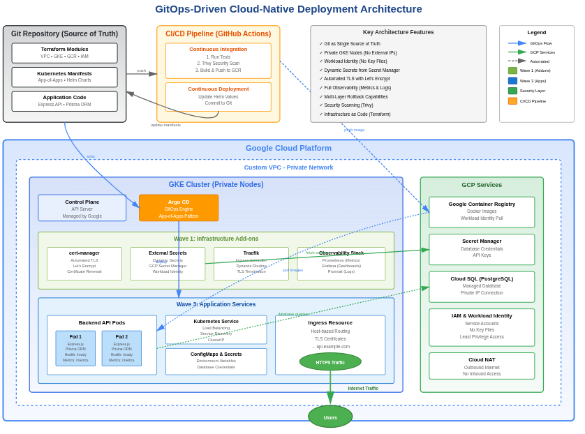

# GitOps-Driven Cloud-Native Deployment on GCP

_Kubernetes · GCP · Terraform · GitHub Actions · Argo CD · External Secrets Operator_

This repository demonstrates a **production-grade GitOps workflow** for deploying a cloud-native Express API on GCP using GKE.  
Infrastructure is provisioned with Terraform using Workload Identity Federation, deployments are managed declaratively via Git, and CI/CD is fully automated with built-in rollback capabilities.

---

## Architecture Overview



**Principles**

- Git as the single source of truth
- Infrastructure as Code using Terraform with modular design
- GitOps-based Continuous Delivery with Argo CD (App-of-Apps pattern)
- Secure, private-by-default networking (nodes on private subnets, no external IPs)
- Automated CI pipelines with security scanning (Trivy)
- Dynamic secrets management via External Secrets Operator
- Full monitoring with Prometheus, Grafana, and Promtail

**Tech Stack**

- **Cloud**: GCP (VPC, GKE, Cloud SQL, Secret Manager, GCR)
- **IaC**: Terraform (Remote State with GCS + State Locking)
- **Orchestration**: Kubernetes (GKE with Workload Identity)
- **GitOps**: Argo CD with App-of-Apps pattern
- **CI/CD**: GitHub Actions (with OIDC/Workload Identity Federation)
- **Ingress**: Traefik
- **TLS**: cert-manager (Let's Encrypt)
- **Secrets**: External Secrets Operator + GCP Secret Manager
- **Container Registry**: Google Container Registry (GCR)
- **Security**: Trivy vulnerability scanning
- **Observability**: Prometheus, Grafana, Promtail, Winston logging
- **Application**: Express.js API with Prisma ORM

---

## Repository Structure

```bash
.
├── terraform-gcp/              # GCP Infrastructure (IaC)
│   ├── modules/
│   │   ├── vpc/
│   │   ├── gke/
│   │   └── gcr/
│   ├── main.tf
│   ├── provider.tf             # GCP provider with remote backend
│   ├── vpc.tf
│   ├── gke.tf
│   ├── gcr.tf
│   ├── secrets.tf
│   ├── variables.tf
│   └── outputs.tf
│
├── terraform-aws-old/          # Legacy AWS implementation
│
├── kubernetes/
│   ├── app-of-apps.yaml        # Root Argo CD Application
│   ├── addons/                 # Argo Applications for infrastructure
│   │   ├── cert-manager.yaml
│   │   ├── external-secrets.yaml
│   │   ├── traefik.yaml
│   │   └── prometheus-grafana.yaml
│   ├── cluster-config/         # Cluster-wide configurations
│   │   ├── certificates.yaml
│   │   ├── cluster-issuer.yaml
│   │   ├── service-accounts.yaml  # Workload Identity bindings
│   │   ├── secret-store.yaml
│   │   └── ingress.yaml
│   └── services/
│       ├── apps/               # Argo Applications for services
│       │   └── backend-app.yaml
│       └── backend/            # Helm chart for Express API
│           ├── Chart.yaml
│           ├── values.yaml
│           └── templates/
│
├── .github/
│   └── workflows/
│       ├── terraform.yml       # Infrastructure provisioning via GitOps
│       ├── ci.yaml             # Build, scan, push to GCR
│       └── cd.yaml             # Update Helm values after CI
│
└── README.md
```

---

## Infrastructure Provisioning (Terraform)

### Architecture

- **Custom VPC** with public and private subnets
- **GKE Cluster** with private nodes (no external IPs)
- **Workload Identity** enabled with service accounts for:
  - GCR image pulling
  - Secret Manager access
  - External Secrets Operator
- **Remote Backend**: GCS bucket with state locking
- **IAM**: Least-privilege service accounts and bindings
- **Automated via GitHub Actions** using Workload Identity Federation (no stored credentials)

### Deployment

```bash
cd terraform-gcp
terraform init
terraform plan
terraform apply
```

**GitOps Workflow**: Infrastructure changes are applied via GitHub Actions with manual approval gates.

---

## GitOps Deployment Strategy

### App-of-Apps Pattern

Single entry point for entire cluster state:

```bash
kubectl apply -f kubernetes/app-of-apps.yaml
```

This bootstraps the entire cluster in waves:

1. **Wave 1 - Addons** (`sync-wave: 1`):
   - cert-manager
   - External Secrets Operator
   - Traefik Ingress Controller
   - Prometheus + Grafana

2. **Wave 2 - Cluster Config** (`sync-wave: 2`):
   - TLS Certificates
   - ClusterIssuers
   - Service Accounts (Workload Identity)
   - SecretStores
   - Ingress resources

3. **Wave 3 - Services** (`sync-wave: 3`):
   - Application deployments (backend API)

---

## CI/CD Pipeline

### Continuous Integration (GitHub Actions - `ci.yaml`)

**Triggers**: Push to `main`, changes to application code

1. Checkout source code
2. Run application tests
3. **Security scanning** using Trivy
4. Build Docker image
5. **Push to GCR** (Google Container Registry)
6. Trigger CD workflow

### Continuous Deployment (GitHub Actions - `cd.yaml`)

**Triggers**: Successful completion of CI workflow

1. Checkout repository
2. Update `kubernetes/services/backend/values.yaml` with new image tag
3. Commit and push changes to Git
4. **Argo CD automatically syncs** the new state

### GitOps Sync (Argo CD)

- Monitors Git repository for changes
- Automatically syncs desired state to cluster
- Self-healing enabled (reverts manual changes)
- Auto-pruning of deleted resources

---

## Secrets Management

### External Secrets Operator (ESO)

**Why ESO over Sealed Secrets?**

- Dynamic secret rotation from GCP Secret Manager
- No need to encrypt/decrypt manually
- Centralized secret management
- Audit trail in GCP

**Flow**:

1. Secrets stored in **GCP Secret Manager**
2. **SecretStore** resource connects to GCP via Workload Identity
3. **ExternalSecret** resources pull secrets dynamically
4. Kubernetes Secrets created automatically

**Example**:

```yaml
apiVersion: external-secrets.io/v1beta1
kind: ExternalSecret
metadata:
  name: db-credentials
spec:
  secretStoreRef:
    name: gcp-secret-store
  target:
    name: db-secret
  data:
    - secretKey: password
      remoteRef:
        key: db-password
```

---

## Kubernetes Deployment

### Backend Service (Express API)

- **Helm Chart** for templating
- **Prisma ORM** for database access (Cloud SQL)
- **Health Checks**:
  - Liveness probe: `/health`
  - Readiness probe: `/ready`
- **Metrics**: Exposes `/metrics` endpoint for Prometheus scraping
- **Logging**: Winston logger with JSON format for Promtail ingestion

### Deployment Configuration

```yaml
# Liveness and Readiness Probes
livenessProbe:
  httpGet:
    path: /health
    port: 3000
  initialDelaySeconds: 30
  periodSeconds: 10

readinessProbe:
  httpGet:
    path: /ready
    port: 3000
  initialDelaySeconds: 5
  periodSeconds: 5

# Resource Limits
resources:
  requests:
    cpu: 100m
    memory: 128Mi
  limits:
    cpu: 500m
    memory: 512Mi
```

---

## Ingress & TLS

### Traefik Ingress Controller

- Installed via Helm in `addons/`
- Exposes services externally
- Routes traffic based on hostnames

### TLS with cert-manager

- **Automatic certificate issuance** via Let's Encrypt
- **Auto-renewal** before expiration
- ClusterIssuer configured for production

---

## Observability Stack

### Metrics (Prometheus + Grafana)

- **Prometheus**: Scrapes `/metrics` from Express API
- **Grafana**: Visualizes metrics with pre-configured dashboards
- **Application Metrics**: Custom business metrics exposed via Prometheus client

---

## Rollback Strategy

### Argo CD Rollback

**Automatic Rollback on Failure**:

```yaml
spec:
  syncPolicy:
    automated:
      prune: true
      selfHeal: true
    retry:
      limit: 3
      backoff:
        duration: 5s
        factor: 2
        maxDuration: 3m
```

**Manual Rollback**:

```bash
# Via Argo CD CLI
argocd app rollback backend <REVISION>

# Via Helm (if needed)
helm rollback backend <REVISION> -n production
```

### Database Migration Rollback

**Prisma Migrations**:

```bash
# Check migration status
npx prisma migrate status

# Rollback failed migration
npx prisma migrate resolve --rolled-back <MIGRATION_NAME>

# Apply previous migration
npx prisma migrate deploy
```

**Best Practices**:

- Always test migrations in staging first
- Use Prisma's migration history for version control
- Keep database backups before major schema changes

### Git-Based Rollback

Since Git is the source of truth:

```bash
# Revert to previous commit
git revert HEAD
git push origin main

# Argo CD will automatically sync the reverted state
```

---

## Security Highlights

### Infrastructure Security

- **Private GKE nodes**: No external IPs, access via bastion or IAP
- **Workload Identity**: No service account key files
- **Network policies**: Restrict pod-to-pod communication
- **Least-privilege IAM**: Granular permissions per service account

### Application Security

- **No plaintext secrets**: All secrets in GCP Secret Manager
- **Vulnerability scanning**: Trivy scans on every build
- **TLS everywhere**: All external traffic encrypted
- **OIDC for CI/CD**: No long-lived GitHub credentials

---

## Deployment Workflow

### Initial Setup

1. **Provision Infrastructure**:

   ```bash
   cd terraform-gcp
   terraform init
   terraform apply
   ```

2. **Configure kubectl**:

   ```bash
   gcloud container clusters get-credentials <CLUSTER_NAME> --region <REGION>
   ```

3. **Bootstrap GitOps**:

   ```bash
   kubectl apply -f kubernetes/app-of-apps.yaml
   ```

### Daily Development Workflow

1. **Develop**: Make code changes locally
2. **Push**: Push to `main` branch
3. **CI**: GitHub Actions builds, scans, and pushes image
4. **CD**: GitHub Actions updates Helm values
5. **Sync**: Argo CD deploys new version automatically
6. **Monitor**: Check Grafana dashboards

---

## Key Achievements

- ✅ **End-to-end GitOps** workflow with single `kubectl apply`
- ✅ **Zero-trust security** with Workload Identity and dynamic secrets
- ✅ **Fully automated CI/CD** with no manual deployments
- ✅ **Production-ready observability** with metrics and logging
- ✅ **Infrastructure as Code** with modular Terraform
- ✅ **Declarative everything**: Git is the source of truth
- ✅ **Built-in rollback** at multiple layers (Git, Argo CD, Helm, DB)

---
